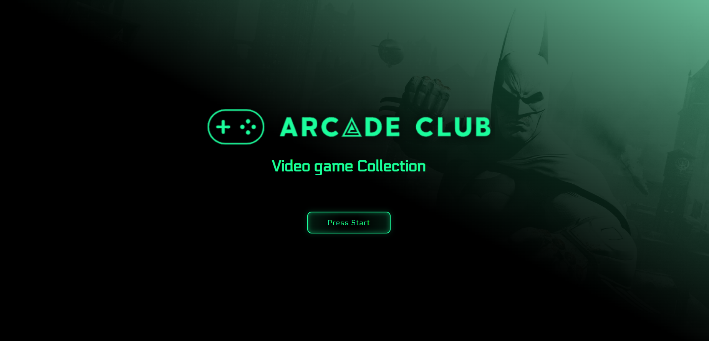
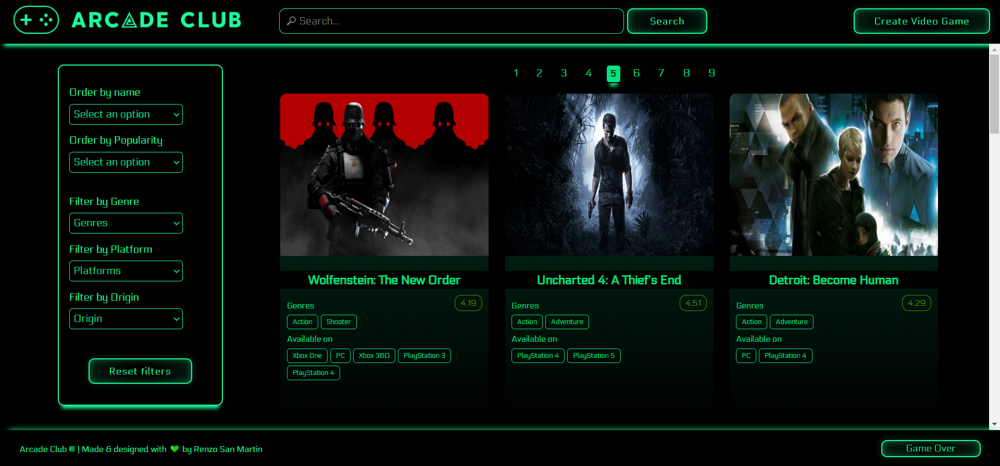
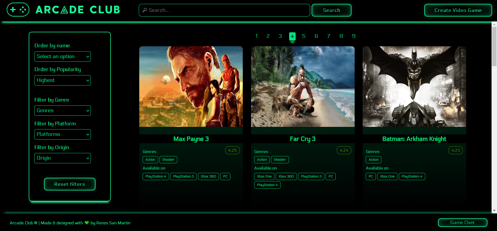
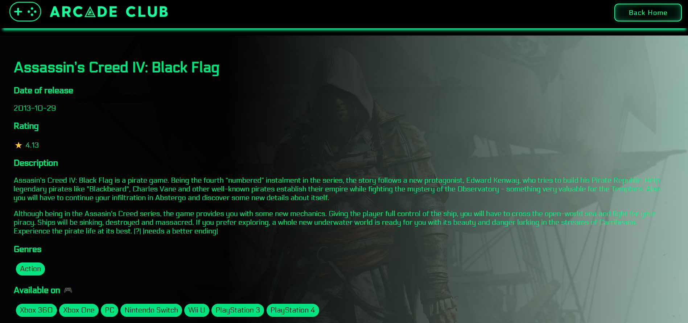

  

# [Videogames App](https://videogames-pi-five.vercel.app/)

This web application was developed by [Renzo San Martin](https://www.linkedin.com/in/renzo-san-martin-alberca-5b07b3130/) as an assignment (Individual Project) in the Full-Stack Developer bootcamp at [Henry](https://www.soyhenry.com/).

## Project goals

- To develop a Web app using React, Redux, Node, Sequelize, etc.
- To affirm, connect and apply all the concepts learned throughout the Bootcamp.
- To learn and practice the GIT workflow.
- And, to learn best practices.

## BoilerPlate

The structure of the project is conformed of 02 main folders: `api` (back-end) and `client` (front-end).

## Project description

The overall idea of this project is to create a web app in which you can see some of the different video games available, along with relevant information about them, using the info provided by the [RAWG](https://rawg.io/apidocs) Video games Database API. The app has the following features that allow you to:

- Search video games either by name or keywords.
- Filter the video games by genre, platform, etc.
- Order them by name (alphabetically) and popularity (rating).
- Create your own video games.

### Technologies

This app was developed using the following tools:

- Node.js
- React.js
- Redux
- Express
- Sequelize
- PostgreSQL

## Front-end

The development of the graphical UI of this website was made through the use of [React](https://reactjs.org/) and [Redux](https://redux.js.org/).

- React.js is a declarative and component-based JS library for building user interfaces, and Redux is a predictable, centralized and flexible state container for JS Apps.

Base URL : `https://videogames-pi-five.vercel.app/`

### **Landing Page**

`https://videogames-pi-five.vercel.app/`

  

### **Home**

`https://videogames-pi-five.vercel.app/home`

- Search bar: you can find the names by name, typing the word in the input.
- The video games listing, here you'll find the card of each game with the following details:

  - Name.
  - Rating.
  - Genres.
  - Platforms it is available on.

  The listing has pagination so it shows only 15 video games per page.

- Filtering and ordering area:
  - Filter options: by genre, platform, etc.
  - Order options: alphabetically and by rating.

  

Example of ordering by popularity:

  

### **Video game detail**:

`https://videogames-pi-five.vercel.app/videogame/${videogame_id}`

Here you'll find more information about the selected video game such as:

- Name
- Description
- Image
- Date of release
- Rating
- Genres
- Platforms

  

**Video game creation**:

`https://videogames-pi-five.vercel.app/videogame`

This route contains a creation form with the data needed in order to create, successfully, a new video game:

- Name\*
- Description\*
- Image
- Date of release\*
- Rating\*
- Platforms\*
- Genres\*

The form is validated using `JavaScript` so no video games are created with the wrong information.
(\*) Required fields.

## Backend

Back-end development means working on server-side software, which focuses on everything you can't see on a website. Back-end developers ensure the website performs correctly, focusing on databases, back-end logic, application programming interface (APIs), architecture, and servers.

The server was developed using [Express](https://expressjs.com/).

- Express is a minimal and flexible Node.js web application framework that provides a robust set of features for web and mobile applications.

These are the routes used:

- Routes HTTP GET requests to the specified path with the specified callback functions.

  - **`GET /videogames`**:

    - Fetch 120+ videogames from the RAWG API.

  - **`GET /videogames?name="searchedName"`**:

    - Gets the first 15 videogames matching the string passed as query parameter.
    - If it does not find any video games, it shows an adequate message.

  - **`GET /videogame/{videogame_id}`**:

    - Fetch the details of the video game with the matching ID.

  - **`GET /genres`**:
    - Fetch all the available genres of the video games.

- Routes HTTP POST requests to the specified path with the specified callback functions.

  - **`POST /videogames`**:
    - Receives all the required data from the controlled video game creation form.
    - Creates a new video game and associates, through the database relations, the genres of the video game.

## Database

The database was created using technologies such as [Sequelize](https://sequelize.org/) and [PostgreSQL](https://www.postgresql.org/).

- Sequelize is a modern Node.js ORM\*\* for PostgresSQL. Featuring solid transaction support, relations, eager and lazy loading, read replication and more.
- PostgreSQL is a powerful, open source object-relational database system.

(\*\*) Object-relational mapping (ORM) is a programming technique in which a metadata descriptor is used to connect object code to a relational database.

The models\*\*\* defined for the database are shown below:

(\*\*\*) Models are the essence of Sequelize. A model is an abstraction that represents a table in the database. The model tells Sequelize several things about the entity it represents, such as the name of the table in the database and which columns it has (and their data types).

- Videogame model with the following attributes:

  - ID:
    - Primary key
    - type: DataTypes.UUID
  - Name:
    - type: DataTypes.STRING
  - Description:
    - type: DataTypes.TEXT
  - Date of release:
    - type: DataTypes.STRING
  - Image:
    - type: DataTypes.TEXT
  - Platforms:
    - type: DataTypes.ARRAY(DataTypes.STRING)
  - Rating:
    - type: DataTypes.DECIMAL
  - Created by User:
    - type: DataTypes.BOOLEAN

- Genre model with the following attributes:

  - ID: Primary key. Created by default.
  - Name:
    - type: DataTypes.STRING
